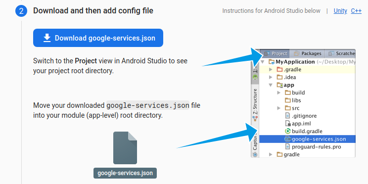

# ReliableFCM
Android app for testing reliable push notifications via Firebase

# Integrate with your Firebase project

1. Create a Firebase project in [Google Firebase Console](https://console.firebase.google.com/)
2. Open Project Settings
3. Add Android App
4. Download file `google-services.json`
5. Store it into directory `app` of the android project

        